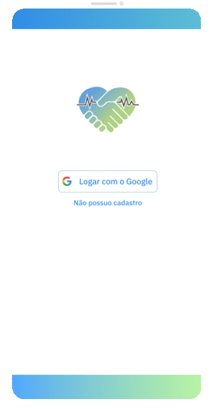
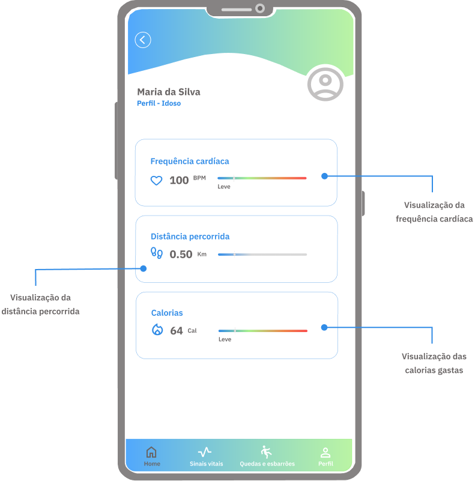

 

# FRIEND - Aplicativo de Monitoramento de Saúde

## Descrição

O **FRIEND** é um aplicativo projetado para conectar cuidadores e monitorar a saúde de idosos. Ele oferece uma série de funcionalidades, incluindo o acompanhamento de sinais vitais, detecção de quedas, e gestão de perfil.

  

### Funcionalidades
- **Monitoramento de Sinais Vitais**: Acompanhe os sinais vitais de forma fácil e acessível.
- **Detecção de Quedas**: Receba alertas imediatos em caso de quedas.
- **Gestão de Perfil**: Gerencie informações pessoais e de saúde em um único lugar.

### Plataforma PARTNER
Plataforma para Desenvolvimento de Aplicações IoHT Autoadaptativas baseado na Arquitetura de Microsserviços

## Contato

Para mais informações ou suporte, entre em contato:

-  **Instagram**: [@_gotest](https://www.instagram.com/_gotest/)
-  **LinkedIn**: [GoTest Consultoria](https://www.linkedin.com/company/gotestconsultoria/)
-  **WhatsApp**: [Clique aqui para nos contatar via WhatsApp](https://api.whatsapp.com/send?phone=5585997181893&text=Ol%C3%A1,%20eu%20vim%20pelo%20site%20do%20Friend!)
- **E-mail**: contato@gotest.com.br

## Desenvolvimento

O site é desenvolvido com HTML, CSS e JavaScript, utilizando o Google Fonts para a tipografia e ícones para redes sociais. A estrutura é responsiva e otimizada para dispositivos móveis.

## Licença

Este projeto é propriedade da **GoTest** e é protegido por direitos autorais. Todos os direitos são reservados.
